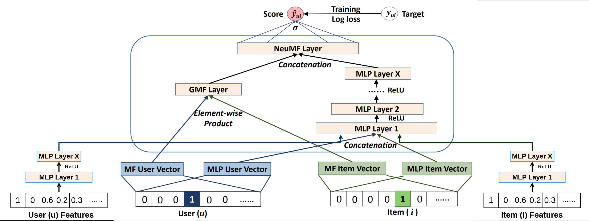

# NCF Recommender System with PyTorch: A Deep Dive

Welcome to the NCF Recommender System with PyTorch! In this project, An end-to-end Recommender System using an adjusted version of Neural Collaborative Filtering (NCF) with PyTorch. the model is trained on the [MovieLens-1M](https://grouplens.org/datasets/movielens/1m/) dataset 🎥, served using FastAPI, hosted on Heroku 🚀.

## 🌟 Try it out!

- Website: [https://ncf-recommender.herokuapp.com/](https://ncf-recommender.herokuapp.com/)
- API: [https://ncf-recommender.herokuapp.com/docs](https://ncf-recommender.herokuapp.com/docs)

## 📓 Notebook on Kaggle

- Notebook: [NCF Recommender System with PyTorch: A Deep Dive](https://www.kaggle.com/code/oyounis/ncf-recommender-system)

## 🌐 Overview

- Our adjusted architecture of NCF enables the input of the user/item features besides the user/item IDs.

- A recommender system is not just a ranking model, but a pipeline: Items Retrieval, Filtering, Ranking, and Ordering. (Detailed explanation in the notebook)

## 📚 Project Structure

- `app/`:

  - **main.py**: The FastAPI app to serve the model.
  - `model/`:
    - **main.ipynb**: The main notebook containing the entire project.
    - `utils/`:
      - `model.py`: The NCF model.
      - `utils.py`: Utility functions for data processing.
      - `requests.py`: Request class to make API requests.
    - `data/`: Processed data for inference.
    - `weights/`: Pretrained models weights for inference.

# References

- [Neural collaborative filtering Paper](https://arxiv.org/abs/1708.05031)
- [Medium: Recommender Systems, Not Just a Recommender Models](https://medium.com/nvidia-merlin/recommender-systems-not-just-recommender-models-485c161c755e)
- [MovieLens-1M](https://grouplens.org/datasets/movielens/1m/)

## 💡 Contributing

Contributions are welcome! If you find a typo, want to add more content, or improve something, feel free to open an issue or submit a pull request.

Happy learning! 🚀
